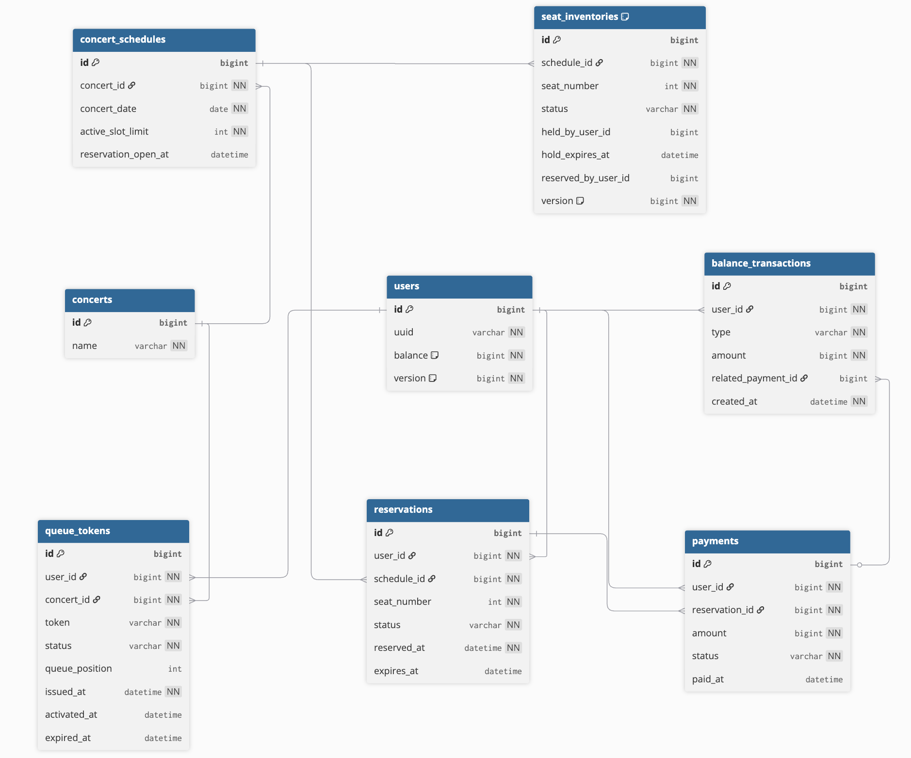

# ERD

## 개요

이 문서는 콘서트 예약 서비스의 데이터 모델을 정리한 ERD 문서다.  
현재 설계는 다음 원칙을 따른다.

- 좌석 현재 상태의 단일 기준은 `seat_inventories`다.
- 예약 이력과 결제 이력은 별도 테이블로 분리한다.
- JPA 엔티티는 연관관계를 최소화하고 FK ID 중심으로 설계한다.
- DB 테이블 간 외래키 제약은 두지 않고, 참조 무결성은 애플리케이션 서비스와 도메인 규칙에서 검증한다.

## ERD 이미지

이 ERD 이미지는 dbdiagram을 사용해 작성했다.  
이미지는 설계 확인용 산출물이며, 실제 구조 변경 시 원본 코드와 함께 수정한다.

---

## 설계 의도

### 1. SeatInventory 중심 설계

현재 좌석 상태는 `seat_inventories`를 기준으로 관리한다.

이 테이블은 좌석의 현재 상태를 나타내는 단일 기준이며, 다음 상태를 가진다.

- `AVAILABLE`
- `HELD`
- `RESERVED`

즉, "지금 이 좌석이 예약 가능한가?"라는 질문에 대한 답은 `seat_inventories`를 조회해서 판단한다.

반면 `reservations`는 예약 이력과 상태 흐름을 기록하는 역할을 가진다.  
현재 상태와 이력을 분리함으로써, 조회와 정합성 제어를 단순하게 유지하려는 의도가 있다.

---

### 2. 사용자 잔액은 users 테이블에서 직접 관리

잔액은 별도 `user_balances` 테이블로 분리하지 않고 `users.balance`에 포함했다.

이유는 다음과 같다.

- 학습 프로젝트 관점에서 구조를 과도하게 복잡하게 만들지 않기 위해
- 잔액 변경 이력은 `balance_transactions`로 별도 관리할 수 있기 때문에
- 동시성 제어는 `users.version`을 통한 낙관적 락으로 처리할 수 있기 때문에

---

### 3. 대기열은 콘서트별로 관리

`queue_tokens`는 콘서트별 대기열을 표현한다.

핵심 정책은 다음과 같다.

- 대기열은 글로벌이 아니라 콘서트별이다.
- 토큰 상태는 `WAITING`, `ACTIVE`, `USED`, `EXPIRED`를 가진다.
- 각 회차(`concert_schedule`)는 동시에 처리 가능한 `ACTIVE` 슬롯 수를 가진다.
- `ACTIVE` 슬롯이 비면 가장 앞선 `WAITING` 토큰이 승격된다.

현재 설계에서는 대기열을 콘서트별로 관리하므로 `queue_tokens`는 `concert_id`를 기준으로 발급된다.

---

### 4. 날짜 = 회차

프로젝트 단순화를 위해 날짜를 회차와 동일하게 간주했다.

즉, `concert_schedules`는 예약 가능한 날짜이면서 동시에 예약 단위인 회차(schedule) 역할을 한다.  
한 공연장에서는 하루 하나의 콘서트만 열린다고 가정한다.

---

## 주요 테이블 설명

### concerts

콘서트 기본 정보 테이블.

주요 컬럼:

- `id`
- `name`

---

### concert_schedules

예약 가능한 날짜이자 회차 정보 테이블.

주요 컬럼:

- `concert_id`
- `concert_date`
- `active_slot_limit`
- `reservation_open_at`

`active_slot_limit`은 해당 회차에서 동시에 예약 또는 결제를 진행할 수 있는 대기열 ACTIVE 인원 수를 의미한다.

---

### users

사용자 기본 정보 및 현재 잔액을 관리하는 테이블.

주요 컬럼:

- `uuid`
- `balance`
- `version`

`version`은 잔액 차감 시 낙관적 락에 사용한다.

---

### queue_tokens

대기열 토큰 테이블.

주요 컬럼:

- `user_id`
- `concert_id`
- `token`
- `status`
- `queue_position`
- `issued_at`
- `activated_at`
- `expired_at`

현재 설계에서는 콘서트별 대기열 정책을 사용하므로 `concert_id`를 기준으로 토큰을 발급한다.

---

### seat_inventories

현재 좌석 상태를 관리하는 핵심 테이블.

주요 컬럼:

- `schedule_id`
- `seat_number`
- `status`
- `held_by_user_id`
- `hold_expires_at`
- `reserved_by_user_id`
- `version`

이 테이블은 좌석의 현재 상태를 관리하며, 동시성 제어의 중심이 된다.  
`version`은 좌석 상태 변경 시 낙관적 락 또는 상태 충돌 감지에 활용할 수 있다.

---

### reservations

예약 이력 및 상태 전이 기록 테이블.

주요 컬럼:

- `user_id`
- `schedule_id`
- `seat_number`
- `status`
- `reserved_at`
- `expires_at`

상태 예시:

- `TEMPORARY`
- `CONFIRMED`
- `EXPIRED`
- `CANCELLED`

---

### payments

결제 이력 테이블.

주요 컬럼:

- `user_id`
- `reservation_id`
- `amount`
- `status`
- `paid_at`

상태 예시:

- `SUCCESS`
- `FAILED`

---

### balance_transactions

잔액 변동 이력 테이블.

주요 컬럼:

- `user_id`
- `type`
- `amount`
- `related_payment_id`
- `created_at`

타입 예시:

- `CHARGE`
- `USE`

---

## 상태값 정리

### queue_tokens.status

- `WAITING`
- `ACTIVE`
- `USED`
- `EXPIRED`

### seat_inventories.status

- `AVAILABLE`
- `HELD`
- `RESERVED`

### reservations.status

- `TEMPORARY`
- `CONFIRMED`
- `EXPIRED`
- `CANCELLED`

### payments.status

- `SUCCESS`
- `FAILED`

### balance_transactions.type

- `CHARGE`
- `USE`

---

## 인덱스 및 제약조건에서 중요하게 볼 점

### seat_inventories

추천 제약:

- `(schedule_id, seat_number)` unique

추천 이유:

- 한 회차에서 좌석 번호는 유일해야 하기 때문
- 좌석 현재 상태를 빠르게 찾기 위해서

### queue_tokens

추천 제약:

- `token` unique

추천 이유:

- 토큰 자체는 중복되면 안 되기 때문

### users

추천 제약:

- `uuid` unique

### concert_schedules

검토할 제약:

- `(concert_id, concert_date)` unique

이유:

- 동일 콘서트에 대해 같은 날짜(=회차)가 중복 생성되지 않도록 하기 위해

### payments

현재 설계에서는 예약 1건당 결제 1건을 기본 정책으로 보므로, `reservation_id`에 unique 제약을 둘 수 있다.

---

## FK 제약을 두지 않은 이유

이 ERD의 관계선은 논리적 참조를 의미하며, 실제 DB 외래키 제약은 두지 않는다.

이유는 다음과 같다.

- JPA 엔티티 간 결합도를 낮추기 위해
- FK ID 중심 설계를 유지하기 위해
- 서비스 레이어에서 명시적으로 검증하는 구조를 유지하기 위해
- 학습 프로젝트에서 도메인 규칙과 애플리케이션 검증 책임을 분명히 드러내기 위해

즉, 물리적 외래키 제약은 없지만 논리적 참조 관계는 유지한다.

---

## ERD만으로 표현되지 않는 제약

다음 제약은 ERD만으로 완전히 표현되지 않으며, 애플리케이션 로직과 동시성 제어 전략으로 보완해야 한다.

### 1. 한 사용자는 동시에 하나의 임시 배정만 가능

이 제약은 단순 조회 규칙이 아니라 동시성 제약이다.  
서비스 조회만으로 완전히 보장할 수 없으며, 트랜잭션 내 재검증과 필요 시 사용자 기준 락 또는 보조 전략이 필요하다.

### 2. 좌석 중복 예약 방지

동일한 `schedule_id`, `seat_number`에 대해 동시에 예약 요청이 들어올 수 있으므로, 조건부 업데이트와 상태 재검증이 필요하다.

### 3. 만료 직전 결제 요청 처리

`hold_expires_at` 경계 시점에 결제 요청과 만료 처리 스케줄러가 충돌할 수 있다.  
실제 정합성 판단은 트랜잭션 안에서 다시 검증해야 한다.

### 4. 대기열 승격 보정

`WAITING -> ACTIVE` 승격은 단순 조회만으로 끝나지 않으며, ACTIVE 슬롯이 비는 시점에 맞춰 보정 로직이 필요하다.

---

## 이후 확장 포인트

- DB 락 기반 동시성 제어
- Redis 기반 분산 락
- 캐시 전략 적용
- 실시간 랭킹 기능
- Kafka 기반 비동기 후처리
- 도메인별 서버와 DB 분리 시 트랜잭션 한계 검토

이 문서는 현재 단계의 설계를 기준으로 하며, 이후 단계에서 확장될 수 있다.

---

## 참고
- 본 문서는 현재 학습 단계 기준 설계를 설명하며, 이후 단계에서 락 전략, 캐시 전략, 비동기 처리 구조에 따라 일부 컬럼 또는 보조 테이블이 추가될 수 있다.