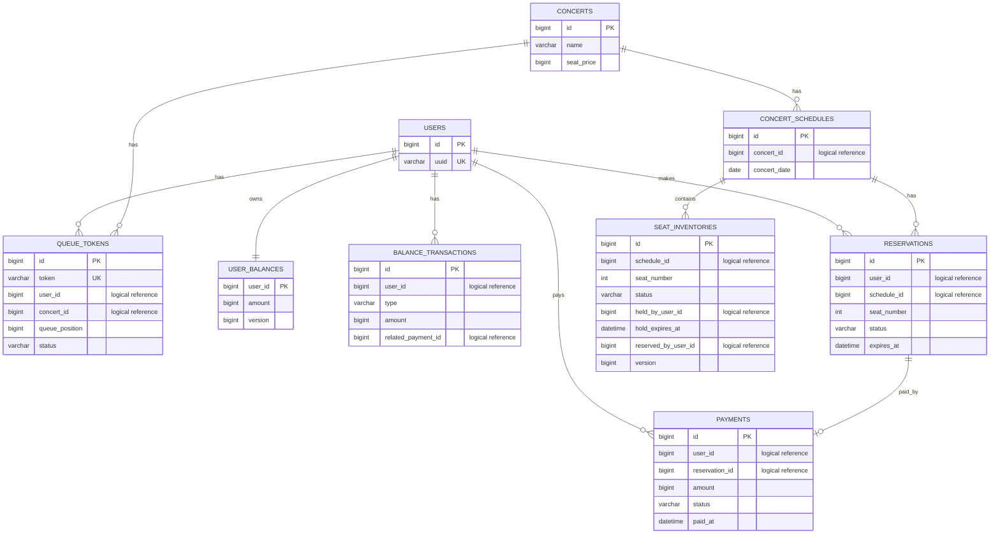

# 콘서트 예약 서비스 ERD 초안

## 1. 문서 목적

이 문서는 콘서트 예약 서비스의 테이블 초안, 주요 컬럼, 관계, 제약 조건을 정리한다.

주의:

- 이 문서의 `xxx_id` 표기는 DB 외래키 제약이 아니라 참조 ID 또는 logical reference를 의미한다.
- 실제 외래키 제약은 두지 않는다.

본 ERD는 아래 정책을 반영한다.

- 대기열은 콘서트별로 관리한다.
- 날짜는 회차와 동일하다.
- 좌석은 회차별 1번부터 50번까지 존재한다.
- 한 사용자는 동시에 하나의 임시 배정만 가질 수 있다.
- 좌석 가격은 고정이다.

## 2. 엔티티 관계 개요

```text
User 1 --- N QueueToken
User 1 --- 1 UserBalance
User 1 --- N BalanceTransaction
User 1 --- N Reservation
User 1 --- N Payment

Concert 1 --- N ConcertSchedule
Concert 1 --- N QueueToken

ConcertSchedule 1 --- N SeatInventory
ConcertSchedule 1 --- N Reservation

Reservation 1 --- 0..1 Payment
Payment N --- 1 User
Payment N --- 1 Reservation
```

## 3. 테이블 초안

### 3.1 users

용도:

- 사전 생성된 사용자 정보 관리

주요 컬럼:

- `id` BIGINT PK
- `uuid` VARCHAR(36) NOT NULL UNIQUE
- `created_at` DATETIME NOT NULL
- `updated_at` DATETIME NOT NULL

### 3.2 concerts

용도:

- 콘서트 기본 정보 관리

주요 컬럼:

- `id` BIGINT PK
- `name` VARCHAR(100) NOT NULL
- `seat_price` BIGINT NOT NULL
- `created_at` DATETIME NOT NULL
- `updated_at` DATETIME NOT NULL

설명:

- 좌석 가격이 고정이므로 콘서트 단위 고정 가격으로 관리할 수 있다.

### 3.3 concert_schedules

용도:

- 콘서트 회차 정보 관리

주요 컬럼:

- `id` BIGINT PK
- `concert_id` BIGINT NOT NULL logical reference
- `concert_date` DATE NOT NULL
- `created_at` DATETIME NOT NULL
- `updated_at` DATETIME NOT NULL

제약:

- `UNIQUE (concert_id, concert_date)`

설명:

- 날짜가 곧 회차이므로 별도 회차 번호 없이 날짜를 회차 식별값으로 사용한다.
- `concert_id`는 `concerts.id`를 가리키는 참조 ID다.

### 3.4 queue_tokens

용도:

- 콘서트별 대기열 토큰 관리

주요 컬럼:

- `id` BIGINT PK
- `token` VARCHAR(100) NOT NULL UNIQUE
- `user_id` BIGINT NOT NULL logical reference
- `concert_id` BIGINT NOT NULL logical reference
- `queue_position` BIGINT NOT NULL
- `status` VARCHAR(20) NOT NULL
- `issued_at` DATETIME NOT NULL
- `activated_at` DATETIME NULL
- `expired_at` DATETIME NULL
- `created_at` DATETIME NOT NULL
- `updated_at` DATETIME NOT NULL

인덱스:

- `INDEX idx_queue_tokens_concert_status_position (concert_id, status, queue_position)`
- `INDEX idx_queue_tokens_user_concert (user_id, concert_id)`

설명:

- `user_id`, `concert_id`는 각각 사용자와 콘서트를 가리키는 참조 ID다.

### 3.5 user_balances

용도:

- 현재 잔액 관리

주요 컬럼:

- `user_id` BIGINT PK logical reference
- `amount` BIGINT NOT NULL
- `version` BIGINT NOT NULL
- `created_at` DATETIME NOT NULL
- `updated_at` DATETIME NOT NULL

설명:

- `version`은 낙관적 락에 사용한다.
- `user_id`는 `users.id`를 가리키는 참조 ID다.

### 3.6 balance_transactions

용도:

- 충전 및 사용 내역 관리

주요 컬럼:

- `id` BIGINT PK
- `user_id` BIGINT NOT NULL logical reference
- `type` VARCHAR(20) NOT NULL
- `amount` BIGINT NOT NULL
- `related_payment_id` BIGINT NULL logical reference
- `created_at` DATETIME NOT NULL

인덱스:

- `INDEX idx_balance_transactions_user_created (user_id, created_at)`

설명:

- `user_id`, `related_payment_id`는 논리 참조 ID다.

### 3.7 seat_inventories

용도:

- 회차별 좌석 현재 상태 관리

주요 컬럼:

- `id` BIGINT PK
- `schedule_id` BIGINT NOT NULL logical reference
- `seat_number` INT NOT NULL
- `status` VARCHAR(20) NOT NULL
- `held_by_user_id` BIGINT NULL logical reference
- `hold_expires_at` DATETIME NULL
- `reserved_by_user_id` BIGINT NULL logical reference
- `version` BIGINT NOT NULL
- `created_at` DATETIME NOT NULL
- `updated_at` DATETIME NOT NULL

제약:

- `UNIQUE (schedule_id, seat_number)`
- `CHECK (seat_number >= 1 AND seat_number <= 50)`

인덱스:

- `INDEX idx_seat_inventories_schedule_status (schedule_id, status)`
- `INDEX idx_seat_inventories_hold_expires_at (hold_expires_at)`
- `INDEX idx_seat_inventories_held_by_user (held_by_user_id, status)`

설명:

- 좌석 상태 단일 기준 테이블이다.
- 선점 가능 여부는 상태와 `hold_expires_at`을 함께 본다.
- `schedule_id`, `held_by_user_id`, `reserved_by_user_id`는 논리 참조 ID다.

### 3.8 reservations

용도:

- 임시 배정 및 확정 예약 이력 관리

주요 컬럼:

- `id` BIGINT PK
- `user_id` BIGINT NOT NULL logical reference
- `schedule_id` BIGINT NOT NULL logical reference
- `seat_number` INT NOT NULL
- `status` VARCHAR(20) NOT NULL
- `reserved_at` DATETIME NOT NULL
- `expires_at` DATETIME NOT NULL
- `confirmed_at` DATETIME NULL
- `created_at` DATETIME NOT NULL
- `updated_at` DATETIME NOT NULL

인덱스:

- `INDEX idx_reservations_user_status (user_id, status)`
- `INDEX idx_reservations_schedule_seat (schedule_id, seat_number)`
- `INDEX idx_reservations_expires_at (expires_at)`

설명:

- 한 사용자의 활성 임시 배정 여부 판단에 활용한다.
- 좌석 현재 상태는 `SeatInventory`가 기준이고, 이 테이블은 이력 중심이다.
- `user_id`, `schedule_id`는 논리 참조 ID다.

### 3.9 payments

용도:

- 결제 결과 관리

주요 컬럼:

- `id` BIGINT PK
- `user_id` BIGINT NOT NULL logical reference
- `reservation_id` BIGINT NOT NULL logical reference
- `amount` BIGINT NOT NULL
- `status` VARCHAR(20) NOT NULL
- `paid_at` DATETIME NULL
- `created_at` DATETIME NOT NULL
- `updated_at` DATETIME NOT NULL

제약:

- `UNIQUE (reservation_id)`

인덱스:

- `INDEX idx_payments_user_created (user_id, created_at)`

설명:

- `user_id`, `reservation_id`는 논리 참조 ID다.

## 4. 권장 제약 및 운영 규칙

### 4.1 좌석 관련

- 회차별 좌석 유일성은 `UNIQUE (schedule_id, seat_number)`로 보장한다.
- 실제 좌석 선점은 유니크 제약만으로 끝내지 않고 조건부 업데이트로 처리한다.

### 4.2 사용자 임시 배정 관련

- 한 사용자는 동시에 하나의 임시 배정만 허용한다.
- DB 레벨 완전 강제는 복잡도가 높으므로 우선 서비스 로직 + 트랜잭션 재검증으로 관리한다.
- 필요 시 활성 임시 예약 전용 보조 테이블 도입을 검토할 수 있다.

### 4.3 결제 관련

- 하나의 예약은 최대 하나의 결제 성공 결과만 가진다.
- 결제 확정은 예약, 좌석, 잔액 상태를 같은 트랜잭션 안에서 검증한다.

## 5. Mermaid ERD 초안


